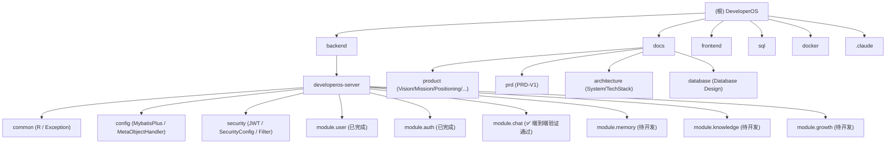

# DeveloperOS

> 与开发者共同成长的 AI 原生成长操作系统。
>
> 项目使命：**帮助开发者成长，陪伴开发者一起成长。**

---

## 文档信息

| 项目     | 内容                  |
| -------- | --------------------- |
| 项目名称 | DeveloperOS           |
| 当前阶段 | V1 MVP                |
| 创建日期 | 2026-07-05            |
| 最后更新 | 2026-07-18            |
| 主语言   | Java 21 / Vue3 + TS   |

---

## 一、高层愿景

DeveloperOS 是一款面向开发者的 **AI 原生成长操作系统（AI Native Growth Operating System）**。

它不是简单的 AI 聊天工具，也不是传统知识管理软件，而是希望成为开发者学习、开发、思考和成长的统一入口。

通过 AI 多轮对话、长期记忆（Memory）、个人知识库（RAG，pgvector）、学习计划与成长记录（Growth）等能力，帮助开发者建立完整的成长体系。

### 核心能力（V1 MVP）

1. **AI 多轮对话** — 多轮上下文 + SSE 流式输出 + 会话管理
2. **长期记忆** — 沉淀学习目标、偏好、项目经历，AI 主动调用
3. **个人知识库（RAG）** — 文档上传、切片、Embedding、检索增强问答
4. **学习与成长** — 学习目标、每日任务、成长日志

### 技术栈一句话总览

- 后端：Spring Boot 3.5.0 + Java 21 + MyBatis-Plus 3.5.5（锁定）+ Spring Security + JJWT + Flyway + Maven + Spring AI 1.0.3
- 前端：Vue3 + TypeScript + Pinia + Vue Router + Element Plus + Axios（**待开发**）
- 数据：PostgreSQL 17 + pgvector + Redis 7
- 部署：Docker Compose

---

## 二、仓库目录结构

### 2.1 目录树

```text
DeveloperOS/
├── docs/                              # 产品与架构文档
│   ├── product/                       # 产品愿景/使命/定位/价值观/路线图
│   ├── prd/                           # V1 PRD
│   ├── architecture/                  # 系统架构与技术栈
│   └── database/                      # 数据库设计
├── backend/
│   └── developeros-server/            # Spring Boot 主服务
│       ├── src/main/java/com/keyx/    # Java 源码
│       ├── src/main/resources/        # 配置 + Flyway 迁移
│       └── pom.xml
├── frontend/                          # 前端（空，待初始化 Vue3）
├── sql/                               # 数据库初始化脚本仓库
├── docker/                            # Docker Compose 编排
├── .claude/                           # AI 上下文（CLAUDE.md 索引）
├── .gitignore
└── README.md
```

### 2.2 Mermaid 仓库结构图



---

## 三、全局开发规范

### 3.1 编码风格

- Java：遵循 Spring Boot + MyBatis-Plus 主流规范；Lombok 简化样板代码。
- 前端：Vue3 `<script setup>` + TypeScript 严格模式 + Pinia 状态管理。
- 命名：Java 用驼峰命名实体，数据库用 `snake_case`。
- 注释：核心业务逻辑使用简短中文注释。
- Controller 只负责参数接收、校验和响应；Service 负责业务逻辑和事务；Mapper 负责数据访问。

### 3.2 分支策略

- `main` — 稳定分支，每次合并需自测通过
- `feature/<module>-<desc>` — 功能分支，例如 `feature/chat-sse`、`feature/rag-upload`
- `fix/<module>-<desc>` — 修复分支
- `docs/<desc>` — 文档变更

### 3.3 提交规范

```
<type>(<scope>): <subject>

type: feat / fix / docs / refactor / test / chore / perf
scope: auth / user / chat / memory / knowledge / growth / infra / docs
subject: 中文或英文简短描述
```

示例：

- `feat(auth): 完成注册登录接口`
- `feat(chat): 接入 SSE 流式输出`
- `fix(rag): 修复文档切片空指针`

### 3.4 安全规则

- **密码**：必须使用 BCrypt 加密，不允许明文、不可逆哈希存储。
- **JWT 密钥**：通过环境变量 `JWT_SECRET` 注入，禁止硬编码或提交。
- **数据库账号**：PostgreSQL/Redis 密码通过 `docker/.env` 注入，不入 git。
- **本地配置**：`application-local.yml` 不入 git（已在 `.gitignore`）。
- **用户数据隔离**：所有查询必须校验当前登录用户；外键不识别所有权。
- **文件存储**：对象存储 key 由后端生成，不允许用户拼接路径。
- **日志规范**：禁止打印密码、Token、API Key、Prompt 完整内容。

### 3.5 AI Agent 偏好（如涉及）

- 用户输入 → Controller → Service 组装 Prompt（系统 Prompt + 历史摘要 + 长期记忆 + RAG Top-K）→ 调用 LLM
- Tool Calling 参数必须用 DTO 严格校验
- 流式输出使用 SSE；不要长事务占用数据库
- Token / 费用 / 超时统一由 Service 封装
- 敏感信息（API Key、用户隐私）禁止写入 Prompt 或日志
- LLM 调用失败必须可重试或降级，不能让用户拿到 500

---

## 四、模块索引

| 模块路径                                        | 状态            | 一句话职责                                                                 | 模块 CLAUDE.md                                                  |
| ----------------------------------------------- | --------------- | -------------------------------------------------------------------------- | --------------------------------------------------------------- |
| `backend/developeros-server`                    | 活跃 / 持续开发 | Spring Boot 主服务（Auth + User + Chat 已完成，Memory/RAG/Growth 待开发）     | [developeros-server/CLAUDE.md](./backend/developeros-server/CLAUDE.md) |
| `backend/`                                      | 目录占位        | 后端总目录，未来可能拆出多个服务                                           | [backend/CLAUDE.md](./backend/CLAUDE.md)                       |
| `frontend/`                                     | 占位            | 前端项目目录（Vue3 + TS 脚手架待搭建）                                     | [frontend/CLAUDE.md](./frontend/CLAUDE.md)                     |
| `docs/`                                         | 文档            | 产品愿景、PRD、架构、数据库设计文档                                        | —                                                               |
| `sql/`                                          | 工具            | 数据库初始化脚本仓库（Flyway 已迁入 `backend/.../db/migration`）          | —                                                               |
| `docker/`                                       | 部署            | Docker Compose 编排（PostgreSQL + Redis + Backend）                        | —                                                               |
| `.claude/index.json`                            | AI 上下文索引   | 模块列表、覆盖率、缺口清单                                                  | —                                                               |

子模块入口（位于 `backend/developeros-server/src/main/java/com/keyx`）：

| 子模块                    | 状态        | 一句话职责                              |
| ------------------------- | ----------- | --------------------------------------- |
| `common`                  | 已完成      | 统一响应 `R<T>`、全局异常处理           |
| `config`                  | 已完成      | MyBatis-Plus 配置 + MetaObjectHandler   |
| `security`                | 已完成      | JWT 工具、Spring Security 配置、过滤器  |
| `module.user`             | 已完成      | 用户实体、Mapper、Service                |
| `module.auth`             | 已完成      | 注册、登录、Token 颁发                  |
| `module.chat`             | ✅ 已完成（端到端验证通过 20/20） | AI 对话（多轮 / SSE / Spring AI / Prompt 组装） |
| `module.memory`           | 待开发      | 长期记忆提取与检索                      |
| `module.knowledge`        | 待开发      | RAG 文档/切片/Embedding/检索           |
| `module.growth`           | 待开发      | 学习目标 / 任务 / 成长日志              |

---

## 五、关键命令

### 5.1 Docker Compose 全栈

```bash
# 启动 PostgreSQL + Redis + Backend
docker compose -f docker/docker-compose.yml up -d

# 查看日志
docker compose -f docker/docker-compose.yml logs -f backend

# 停止并移除容器
docker compose -f docker/docker-compose.yml down

# 重新构建 backend 镜像
docker compose -f docker/docker-compose.yml build backend
```

> 实际敏感配置写在 `docker/.env`（不入 git）。

### 5.2 Maven 命令

```bash
# 在 backend/developeros-server 目录下执行
./mvnw clean package -DskipTests        # 打包
./mvnw spring-boot:run                  # 本地运行（依赖本地 PG/Redis）
./mvnw test                             # 单元测试
./mvnw flyway:migrate                   # Flyway 迁移（需先启动 DB）
```

### 5.3 Flyway 迁移位置

- 迁移脚本目录：`backend/developeros-server/src/main/resources/db/migration/`
- 命名规范：`V<版本>__<描述>.sql`，例如 `V1__init_schema.sql`
- V1 不可修改；后续演进必须新增迁移脚本。
- 数据库对外脚本副本：`sql/v1_init.sql`（已逐步被 Flyway 取代）。

---

## 六、文档导航

| 类别       | 文档                                                                                          |
| ---------- | --------------------------------------------------------------------------------------------- |
| 产品愿景   | [docs/product/Vision.md](./docs/product/Vision.md)                                            |
| 产品使命   | [docs/product/Mission.md](./docs/product/Mission.md)                                          |
| 产品定位   | [docs/product/Product%20Positioning.md](./docs/product/Product%20Positioning.md)              |
| 核心价值   | [docs/product/Core%20Value.md](./docs/product/Core%20Value.md)                                |
| 设计原则   | [docs/product/Design%20Principles.md](./docs/product/Design%20Principles.md)                  |
| 产品路线图 | [docs/product/Product%20Roadmap.md](./docs/product/Product%20Roadmap.md)                      |
| V1 PRD     | [docs/prd/PRD-V1.md](./docs/prd/PRD-V1.md)                                                    |
| 系统架构   | [docs/architecture/SystemArchitecture.md](./docs/architecture/SystemArchitecture.md)          |
| 技术栈     | [docs/architecture/TechStack.md](./docs/architecture/TechStack.md)                            |
| 数据库设计 | [docs/database/Database%20Design.md](./docs/database/Database%20Design.md)                    |

> 文档名称含空格的，请使用 URL 编码 `%20` 或保留空格的文件系统命令访问。

---

## 七、AI 使用指引

- 每个模块目录下都有 `CLAUDE.md`，进入开发时优先阅读对应模块文档。
- 修改公共规范（数据库、安全、全局异常）请同步更新根 `CLAUDE.md`。
- 不要在无用户确认时修改源代码；本仓库中 CLAUDE.md 与源代码同等重要，需共同演进。
- `.claude/index.json` 是断点续扫依据，每次大改动后建议重新生成。

---

## 八、变更记录 (Changelog)

| 日期         | 变更内容                                                                                                                          |
| ------------ | ----------------------------------------------------------------------------------------------------------------------------------- |
| 2026-07-20   | **Chat 模块完成 + 端到端验证通过 20/20**：26 个文件 + 15 项 Review 修复 + 2 个 P0 bug 修复（`created_at` NOT NULL + MyBatis-Plus OGNL 兼容）。锁定版本栈：Spring Boot 3.5.0 + MyBatis-Plus 3.5.5 + MyBatis 3.5.16 + Java 21 + Spring AI 1.0.3。详见 `backend/developeros-server/CLAUDE.md` §9.1 / §9.7。 |
| 2026-07-18   | 初始化根级 CLAUDE.md，新增 Mermaid 仓库结构图与模块索引；建立 `.claude/index.json` 覆盖率与缺口清单。                              |
| 2026-07-17   | Auth 模块完成（注册、登录、JWT、过滤器、全局异常、统一响应），详见 `everyday update/2026-07-17-auth-module-completed.md`。         |
| 2026-07-15   | Docker 全栈环境搭建完成；Spring Boot 后端容器化（两阶段 Dockerfile）；数据库脚本评审 6 项问题，详见 `everyday update/...07-15-...md`。 |
| 2026-07-05   | 产品愿景、使命、定位、价值观、设计原则、路线图文档初稿完成。                                                                       |