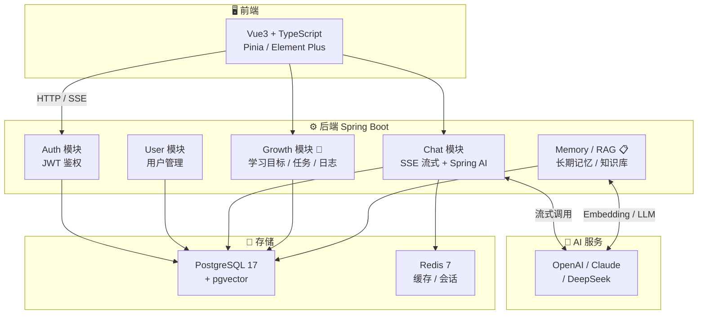

<div align="center">

# 🚀 DeveloperOS

### 与开发者共同成长的 **AI 原生成长操作系统**

> _"AI 不应该只是等待提问的聊天机器人，而应该成为真正理解开发者、陪伴开发者成长的长期伙伴。"_

[English](./README.en.md) · 简体中文 · [项目愿景](./docs/product/Vision.md) · [更新日志](#-更新日志)

---

**V1 MVP 进度** · **3 / 5 核心功能已完成**（端到端验证通过 20/20）

`Auth` ✅ · `User` ✅ · `Chat` ✅ · `Growth` 🚧 · `RAG / Memory` 📋

---


</div>

---

## 📖 项目简介

**DeveloperOS** 是一款面向开发者的 **AI 原生成长操作系统（AI Native Growth Operating System）**。

它不是简单的 AI 聊天工具，也不是传统的知识管理软件，而是希望成为开发者**学习、开发、思考和成长**的统一入口。

通过 **AI 多轮对话**、**长期记忆（Memory）**、**个人知识库（RAG）**、**学习计划与成长记录（Growth）** 等能力，帮助开发者建立完整的成长体系。

### ✨ 核心理念

> **DeveloperOS 不是记录你的知识，而是参与你的成长。**

随着使用时间的增加，DeveloperOS 会越来越了解你：

- 📚 了解你的**学习方向**和**知识体系**
- 💼 了解你的**项目经历**和**技术栈**
- 🎯 了解你的**成长目标**和**当前阶段**
- 💡 在合适的时间**主动提醒**、**建议**、**鼓励**

---

## 🎯 V1 MVP 核心能力

| # | 功能 | 状态 | 描述 |
|---|---|---|---|
| 1 | 🤖 **AI 多轮对话** | ✅ 已完成 | SSE 流式输出 · 多轮上下文 · 会话管理 · Markdown 渲染 |
| 2 | 🧠 **长期记忆** | 📋 V1.x | 沉淀学习目标、偏好、项目经历，AI 主动调用 |
| 3 | 📚 **个人知识库（RAG）** | 📋 V1.x | 文档上传、切片、Embedding、检索增强问答 |
| 4 | 🎯 **学习计划** | 🚧 V1.1 | 学习目标、每日任务、进度跟踪 |
| 5 | 📈 **成长记录** | 🚧 V1.1 | 学习日志、每日记录、周总结、成长轨迹 |

---

## 🛠️ 技术栈

### 后端

| 类别 | 技术 | 版本 |
|---|---|---|
| 语言 | Java | 21 |
| 框架 | Spring Boot | 3.5.0 |
| ORM | MyBatis-Plus | 3.5.5 |
| 安全 | Spring Security + JJWT | 6 + 0.12.6 |
| AI | Spring AI（OpenAI Compatible） | 1.0.3 |
| 校验 | Jakarta Validation | 3.x |
| 构建 | Maven | 3.x |
| 迁移 | Flyway | 10.x |

### 数据存储

| 类别 | 技术 | 版本 | 用途 |
|---|---|---|---|
| 主数据库 | PostgreSQL | 17 | 业务数据 + pgvector 向量 |
| 缓存 | Redis | 7 | Token / 会话上下文 |
| 迁移 | Flyway | - | 数据库版本管理 |

### 前端（待开发）

| 类别 | 技术 | 版本 |
|---|---|---|
| 框架 | Vue | 3.5 |
| 语言 | TypeScript | 5.x |
| 状态 | Pinia | 2.x |
| 路由 | Vue Router | 4.x |
| UI | Element Plus | 2.x |
| HTTP | Axios | 1.x |

### 部署

| 类别 | 技术 |
|---|---|
| 容器化 | Docker + Docker Compose |
| 反向代理 | Nginx（生产环境） |
| CI/CD | GitHub Actions（待配置） |

---

## 🚀 快速开始

### 前置要求

- Docker 20.10+
- Docker Compose 2.0+
- （可选）JDK 21、Maven 3.8+ —— 本地开发用

### 一键启动（推荐）

```bash
# 克隆仓库
git clone https://github.com/keyX-mad/DeveloperOS.git
cd DeveloperOS

# 复制环境变量模板（敏感配置不入 git）
cp docker/.env.example docker/.env  # 或手动创建 docker/.env

# 一键启动 PostgreSQL + Redis + Backend
docker compose -f docker/docker-compose.yml up -d

# 查看后端日志
docker compose -f docker/docker-compose.yml logs -f backend

# 等待 30 秒，应用启动完成
# 访问 http://localhost:9090
```

### 本地开发

```bash
# 1. 启动 PostgreSQL + Redis（仅这两个）
docker compose -f docker/docker-compose.yml up -d postgres redis

# 2. 用 IDE 启动 backend
# IDE 打开 DeveloperosServerApplication，运行 main 方法
# profile 选择 local（读 application-local.yml）

# 或用 Maven 启动
cd backend/developeros-server
./mvnw spring-boot:run -Dspring-boot.run.profiles=local
```

### 环境变量

在 `docker/.env` 中配置（**绝不入 git**）：

```env
POSTGRES_DB=developeros
POSTGRES_USER=keyx
POSTGRES_PASSWORD=your-strong-password

REDIS_PASSWORD=your-strong-password

JWT_SECRET=your-256-bit-secret-at-least-32-bytes-long
JWT_EXPIRATION=604800000

OPENAI_API_KEY=sk-your-openai-key
OPENAI_BASE_URL=https://api.openai.com
OPENAI_MODEL=gpt-4o-mini
```

---

## 📂 项目结构

```text
DeveloperOS/
├── docs/                              # 产品与架构文档
│   ├── product/                       # Vision / Mission / PRD / Roadmap
│   ├── prd/                           # V1 PRD
│   ├── architecture/                  # 系统架构与技术栈
│   └── database/                      # 数据库设计（28 节）
├── backend/
│   └── developeros-server/            # Spring Boot 主服务
│       ├── src/main/java/com/keyx/
│       │   ├── common/                # R / BaseController / GlobalExceptionHandler
│       │   ├── config/                # MybatisPlusConfig / MetaObjectHandler
│       │   ├── security/              # JwtUtil / SecurityConfig / JwtFilter
│       │   └── module/
│       │       ├── auth/              # 注册 / 登录 / JWT ✅
│       │       ├── user/              # 用户管理 ✅
│       │       └── chat/              # AI 对话 + SSE + Spring AI ✅
│       ├── src/main/resources/
│       │   ├── application.yml
│       │   ├── application-local.yml  # 不入 git
│       │   └── db/migration/          # Flyway 迁移脚本
│       └── pom.xml
├── frontend/                          # Vue3（待开发）
├── sql/                               # 数据库初始化脚本（备份）
├── docker/                            # Docker Compose 编排
│   ├── docker-compose.yml
│   └── .env.example
├── CLAUDE.md                          # AI 上下文根索引
└── README.md                          # 你正在看的
```

---

## 🏗️ 系统架构



---

## ✅ 已完成功能

### 🔐 Auth 模块（注册 / 登录 / JWT）

- 用户注册（用户名 / 邮箱唯一性校验、BCrypt 密码加密）
- 用户登录（密码校验、JWT 颁发）
- JWT 鉴权过滤器（从 `Authorization: Bearer` 解析用户身份）
- 用户数据隔离（每个请求 userId 来自 JWT）

### 👤 User 模块

- 用户基础信息管理
- 偏好设置（preferences JSONB）
- 时区支持（默认 Asia/Shanghai）

### 🤖 Chat 模块（V1 核心）

- ✅ **会话管理**：创建、列表、查询、改标题、删除（Cascade 删 messages）
- ✅ **消息管理**：增删改查、状态机（STREAMING → COMPLETED / FAILED / STOPPED）
- ✅ **SSE 流式输出**：用户实时看到 AI 打字效果
- ✅ **Spring AI 集成**：OpenAI Compatible（支持 GPT / Claude / DeepSeek）
- ✅ **Prompt 组装**：System 提示词 + 最近 20 条历史 + 当前消息
- ✅ **abort 中断**：用户主动停止生成（基于 AbortSignal + ConcurrentHashMap）
- ✅ **事务原子性**：用户消息 + AI 占位消息同事务保存
- ✅ **用户隔离**：所有 chat 接口强制 userId 校验
- ✅ **流式防护**：PromptBuilder 跳过 STREAMING 中间态、TOOL 消息
- ✅ **端到端验证 20/20 通过**

---

## 🗺️ 产品路线图

### ✅ Phase 1：MVP（已完成 60%）

- ✅ Auth 模块（注册/登录/JWT）
- ✅ User 模块（基础信息）
- ✅ Chat 模块（AI 对话 / SSE / Prompt 组装）
- 🚧 Growth 模块（学习目标 / 任务 / 日志）—— V1.1
- 📋 Memory / RAG 模块 —— V1.2

### 📋 Phase 2：成长系统（V2.0，2-4 月）

- 学习路径规划（基于 AI 的智能推荐）
- 项目复盘（基于聊天记录自动生成）
- 周报 / 月报（AI 自动汇总）
- 知识图谱（个人知识体系可视化）
- 成长数据分析（趋势图、对比图）

### 📋 Phase 3：开发者工作台（V3.0，4-8 月）

- GitHub 集成（PR / Issue / Commit 同步）
- 项目管理（多项目切换）
- Agent 工作流（自定义 Agent）
- 本地知识库（本地文件索引）
- IDE 集成（VSCode / JetBrains 插件）

### 📋 Phase 4：DeveloperOS 平台（长期）

- 多 Agent 协作
- 插件市场
- 开发者社区
- 团队协作
- 企业版能力

完整路线图见 [docs/product/Product Roadmap.md](./docs/product/Product%20Roadmap.md)

---

## 🧪 测试

```bash
# 在 backend/developeros-server 目录下

# 编译
./mvnw compile

# 运行单元测试
./mvnw test

# 跳过测试打包
./mvnw clean package -DskipTests

# 端到端测试（需要后端运行）
# 详见 CLAUDE.md / docs/database/Database Design.md
```

**当前测试覆盖**：
- ✅ `ConversationServiceImplTest`（9 个测试场景，含用户隔离安全测试）
- ✅ Chat 模块端到端验证 20/20

---

## 📚 文档导航

| 类别 | 文档 | 说明 |
|---|---|---|
| 产品 | [Vision.md](./docs/product/Vision.md) | 产品愿景 |
| 产品 | [Mission.md](./docs/product/Mission.md) | 产品使命 |
| 产品 | [Product Positioning.md](./docs/product/Product%20Positioning.md) | 目标用户与差异化 |
| 产品 | [Design Principles.md](./docs/product/Design%20Principles.md) | 7 大设计原则 |
| 产品 | [Product Roadmap.md](./docs/product/Product%20Roadmap.md) | 4 阶段路线图 |
| PRD | [PRD-V1.md](./docs/prd/PRD-V1.md) | V1 MVP 详细需求 |
| 架构 | [SystemArchitecture.md](./docs/architecture/SystemArchitecture.md) | 系统整体架构 |
| 架构 | [TechStack.md](./docs/architecture/TechStack.md) | 技术选型理由 |
| 数据库 | [Database Design.md](./docs/database/Database%20Design.md) | 28 节数据库设计文档 |
| AI 上下文 | [CLAUDE.md](./CLAUDE.md) | AI 协作上下文根索引 |
| 后端模块 | [developeros-server/CLAUDE.md](./backend/developeros-server/CLAUDE.md) | 后端服务详解 |

---

## 🎓 项目亮点

### 1. 工程化程度高

- ✅ 完整的 CLAUDE.md AI 上下文（根 + 模块）
- ✅ Flyway 数据库迁移（V1 不可改原则）
- ✅ 严格的分层架构（Controller / Service / Mapper / Entity）
- ✅ 用户数据隔离（404 而非 403，防信息泄露）
- ✅ 统一的全局异常处理 + 统一响应格式
- ✅ Docker Compose 一键启动

### 2. 严谨的安全设计

- ✅ BCrypt 密码加密（不存明文）
- ✅ JWT 鉴权 + 过滤器
- ✅ 用户隔离（每个查询强制 userId 校验）
- ✅ 文件存储 key 由后端生成（不信任用户路径）
- ✅ 敏感配置不入 git（`.env` / `application-local.yml`）

### 3. 工程难题的解决

- 🔧 MyBatis-Plus 3.5.5 + MyBatis 3.5.16 的 OGNL sandbox 兼容问题（链式 `.count()` + `@Select` 手写 records）
- 🔧 Spring AI 流式输出与 abort 中断（AbortSignal 内部异常机制）
- 🔧 `created_at` 自动填充（MyMetaObjectHandler 未生效时的临时方案）

---

## 🤝 贡献

这是个人项目，但欢迎任何形式的反馈：

- 🐛 **Bug 报告**：[Issues](../../issues)
- 💡 **功能建议**：[Discussions](../../discussions)
- 📝 **文档改进**：直接 PR

---

## 📄 License

本项目采用 [MIT License](./LICENSE) 开源协议。

---

## 🙏 致谢

- [Spring Boot](https://spring.io/projects/spring-boot) - 应用框架
- [Spring AI](https://spring.io/projects/spring-ai) - AI 集成
- [MyBatis-Plus](https://baomidou.com/) - ORM 增强
- [PostgreSQL](https://www.postgresql.org/) - 主数据库
- [pgvector](https://github.com/pgvector/pgvector) - 向量检索
- [Element Plus](https://element-plus.org/) - UI 组件库
- 所有开源贡献者 🐾

---

<div align="center">

**如果这个项目对你有帮助，欢迎 ⭐ Star 支持！**

[⬆ 返回顶部](#-developeros)

</div>
